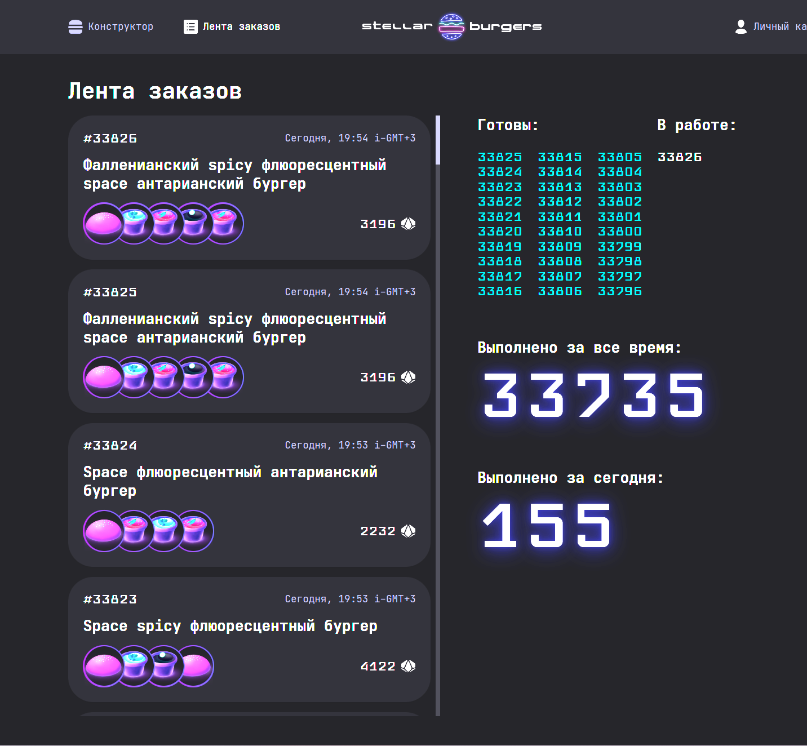
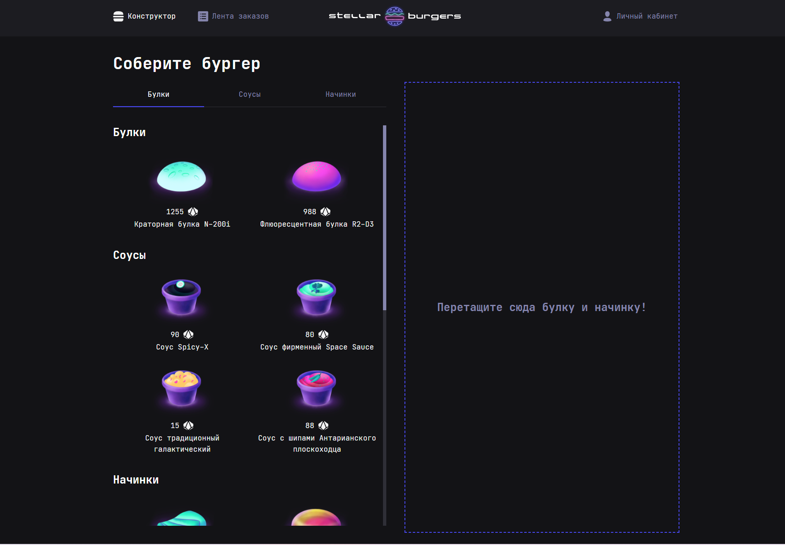
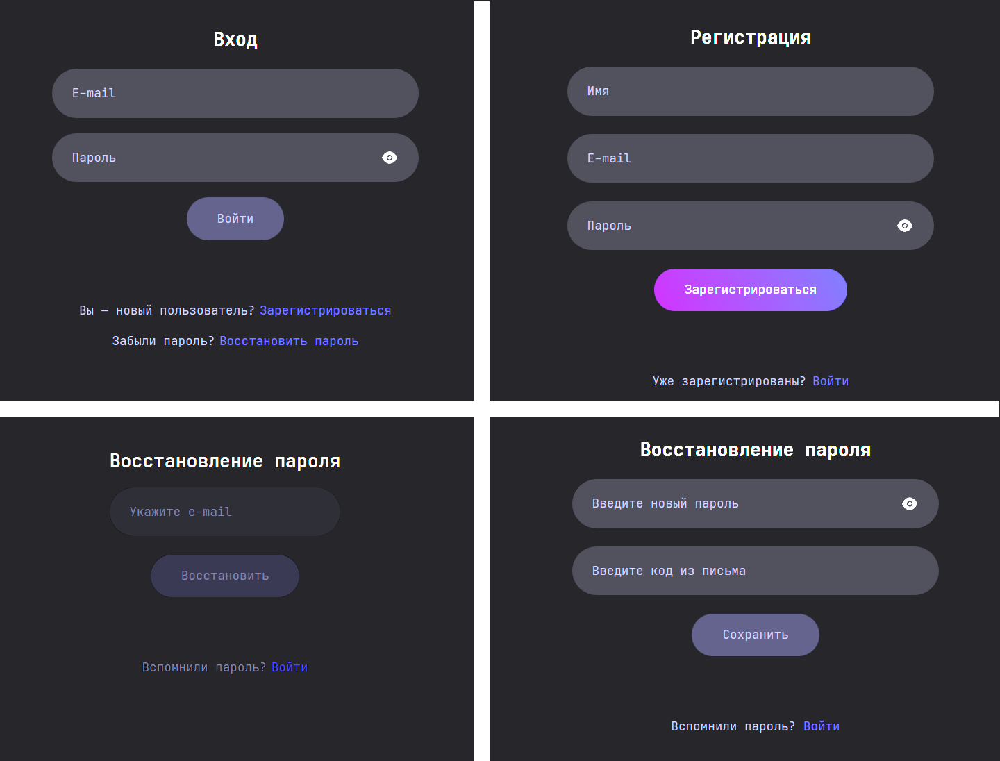

## Проект Stellar-Burgers



___
## Обзор
**Проект в рамках изучения React & Redux & DnD & TS & WebSocket**

Статическая верстка веб-страницы

Функционал:
 * Redux
 
   - Получение списка ингредиентов от API. Используется в компоненте BurgerIngredients;
   - Получение списка ингредиентов для конструктора бургера. Используется в компоненте BurgerConstructor;
   - Добавление данных о просматриваемом в модальном окне IngredientDetails ингредиенте;
   - Удаление данных о просматриваемом в модальном окне ингредиента при закрытии модального окна;
   - Получение и обновление номера заказа в модальном окне OrderDetails;
   - В компоненте BurgerIngredients есть три переключателя: «Булки», «Соусы» и «Начинки». По мере пользовательского скролла ингредиентов в компоненте BurgerIngredients выделяется активным тот переключатель, заголовок которого в самом контейнере ближе всего к верхней левой границе контейнера компонента BurgerIngredients.
 * DnD
 
   - Пользователь может добавить ингредиент из BurgerIngredients в компонент BurgerConstructor;
   - При успешном перетаскивании у ингредиента в BurgerConstructor увеличивается счётчик. Перетаскивать ингредиент (не являющийся булкой) можно многократно;
   - Пользователь может нажать на иконку удаления ингредиента в компоненте BurgerConstructor. Ингредиент удалится из BurgerConstructor, а счётчик количества ингредиентов в компоненте BurgerIngredients уменьшится на один;
   - Если в BurgerConstructor добавлено несколько одинаковых ингредиентов — удаление одного ингредиента не влияет на остальные ингредиенты в BurgerConstructor с тем же _id;
   - Пользователь может изменить порядок ингредиентов в BurgerConstructor перетаскиванием конкретного элемента;
   - При попытке «бросить» ингредиент за пределы BurgerConstructor ничего не происходит — ингредиент возвращается в исходное положение.




* React-Router
   - Регистрация
   - Авторизация и обновление токена
   - Выход из системы
   - Куки
   - Получение и обновление информации о пользователе
   - Защищённые маршруты в приложении



___
## Использованные технологии
* HTML
* CSS
* React - JSX (модульный подход с использованием import, export)
* Hooks
* Redux
* DnD
* Ref
* React Router v5.2.1
* WebSocket
* TypeScript
* Установка заготовенного CRA - npx create-react-app react-burger --template typescript 
* Использована библиотека готовых компонентов - npm i @ya.praktikum/react-developer-burger-ui-components 
* Организована файловая структура: 
  - Компоненты в директории components/ и pages/, изображения — в images, экшены и редьюсеры - services/
  - Каждый компонент хранится в отдельной директории
  - Для стилизации компонентов используются CSS-модули
  - Директории и файлы компонентов в нотации kebab-case

___
## Макет

* [Ссылка на макет в Figma](https://www.figma.com/file/ocw9a6hNGeAejl4F3G9fp8/React-_-%D0%9F%D1%80%D0%BE%D0%B5%D0%BA%D1%82%D0%BD%D1%8B%D0%B5-%D0%B7%D0%B0%D0%B4%D0%B0%D1%87%D0%B8-(3-%D0%BC%D0%B5%D1%81%D1%8F%D1%86%D0%B0)_external_link?node-id=0%3A1)

* [Ссылка на страницу проекта github](https://github.com/EukleidesRUS/react-burger/

___
## Локальная установка и запуск
```
Клонировать репозиторий
  git clone https://github.com/EukleidesRUS/react-burger.git

Войти в проект через консоль
  cd react-burger

Установить зависимости
  npm install

Старт сервера
  npm start
```
